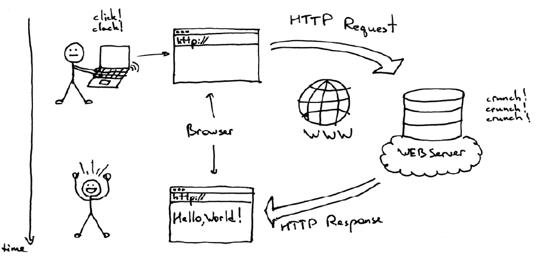
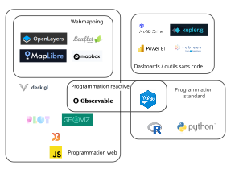
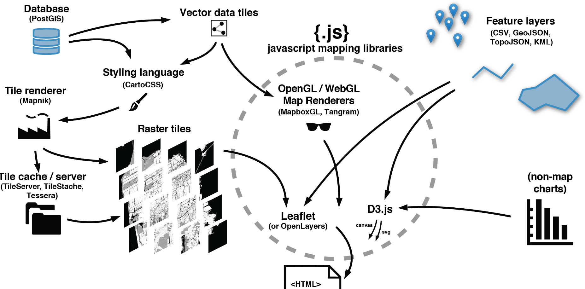

# Architectures web (client/serveur)

Le Web fonctionne sur un modèle **client-serveur** : le navigateur (client) envoie une requête au serveur, qui renvoie une réponse contenant la page ou les données demandées. Le **navigateur** affiche ensuite ces informations à l’écran.

Le **backend** désigne la partie d’une application qui fonctionne « derrière » l’interface, sur le serveur. Il s’occupe notamment de traiter les données, appliquer les règles de fonctionnement, communiquer avec les bases de données et fournir des services au reste de l’application. L’utilisateur ne voit généralement pas directement cette partie. Par exemple, lorsqu’un site affiche les résultats d’une recherche, le backend peut aller chercher les données dans une base, les traiter et les transmettre au navigateur.

Le **frontend** correspond à la partie d’une application visible et directement utilisée par l’utilisateur. Il comprend l’interface, les boutons, les menus, les cartes, les graphiques, les animations, etc. Il fonctionne principalement dans le navigateur web et repose notamment sur HTML, CSS et JavaScript. Dans une application cartographique, par exemple, le frontend est responsable de l’affichage de la carte et des interactions : zoomer, déplacer la carte, cliquer sur un pays ou modifier un indicateur.

On parle de **full stack** lorsqu’une personne ou une application prend en charge à la fois le frontend et le backend. Un développeur full stack peut donc concevoir l’interface visible par l’utilisateur, programmer la logique exécutée côté serveur, gérer les bases de données et assurer la communication entre ces différentes couches. Une application full stack forme ainsi une chaîne complète, de l’interface jusqu’aux données et aux traitements qui se trouvent derrière.

## Panorama des logiciels

## Composition d'une web map

Une **web map** est composée de plusieurs éléments qui travaillent ensemble : le fond de carte (souvent en tuiles raster ou vectorielles), les données géographiques ajoutées par-dessus, et le style qui définit leur apparence. Le tout est affiché dans le navigateur grâce à une bibliothèque JavaScript (comme Leaflet ou MapLibre) qui permet l’interaction — zoom, clics, filtres. Le navigateur récupère les tuiles et les données auprès de serveurs, rendant la carte dynamique et modulaire.

*Source : [https://maptime.fun/anatomy-of-a-web-map](https://maptime.fun/anatomy-of-a-web-map)*

