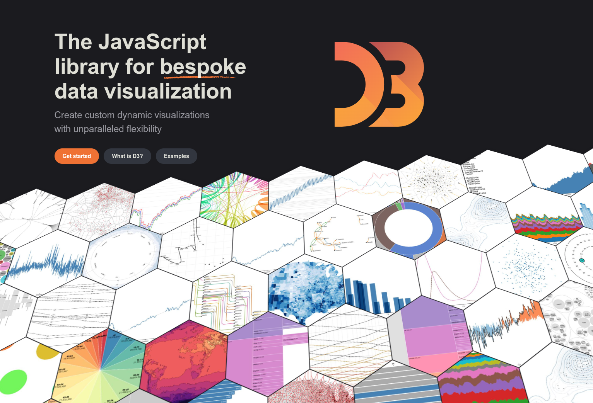

### La dataviz (ou data visualization, en anglais) désigne l’ensemble des méthodes et techniques permettant de représenter visuellement des données pour les rendre plus compréhensibles et accessibles.

👉 L’idée est simple : plutôt que de parcourir de longs tableaux de chiffres, on traduit l’information en graphiques, cartes, diagrammes, infographies ou animations interactives.

D3.js est une des bibliothèques les plus importantes dans l’histoire de la dataviz web. C'ets donc par là que nous allons commencer. 

# D3js

{width="10%"}

d3.js  est une bibliothèque graphique JavaScript développée par **Mike Bostock** qui permet l'affichage de données numériques sous une forme graphique et dynamique. Elles est conforme aux normes W3C et utilise les technologies courantes **SVG**, **JavaScript** et **CSS** pour la visualisation de données. Cette bibliothèque a 10 ans !!! Nous en sommes à la 7e version. Et le développement continue. 

**d3.js** est une grosse librairie (plus de 1000 fonctions) qui fait beaucoup de choses. Depuis 2015, elle est composée de différents modules spécialisés.

Elle permet de dessiner du SVG directement en JavaScript à grace au DOM.

Elle permet de remplacer ça

```{.html .custom-html}
<html>
  <body>
    <svg viewBox="0 0 500 60" style="background-color:#CCC">
      <circle cx="50" cy="30" r="25" fill="#e04a28"/>
      <rect x="100" y="5" height="50" width="50" fill="#5277bf"/>
    </svg>
  </body>
</html>
```


par ça


```{.html .custom-html}
<div id="myDiv"></div>
```


```{.js .custom-js}
import * as d3 from "https://cdn.jsdelivr.net/npm/d3@7/+esm";
const svg = d3
  .create("svg")
  .attr("viewBox", [0, 0, 500, 60])
  .style("background-color", "#CCC");

svg
  .append("circle")
  .attr("cx", 50)
  .attr("cy", 30)
  .attr("r", 25)
  .style("fill", "#e04a28");

svg
  .append("rect")
  .attr("x", 100)
  .attr("y", 5)
  .attr("height", 50)
  .attr("width", 50)
  .style("fill", "#5277bf");

document.querySelector("#myDiv").appendChild(svg.node());
```

La force de D3 (**Data-Driven Documents**) va être de construire des visualisations à partir de données. Par exemple : 

```{.js .custom-js}
const myData = [10, 30, 20, 30, 25]
  const width = 500;
  const height = 75;

  const svg = d3
    .create("svg")
    .attr("viewBox", [0, 0, width, height])
    .style("background-color", "#CCC");

  svg
    .append("g")
    .attr("fill", "#e04a28")
    .selectAll("circle")
    .data(myData)
    .join("circle")
    .attr("cx", (d, i) => 50 + i * 100)
    .attr("cy", height / 2)
    .attr("r", (d) => d);
    document.querySelector("#myDiv").appendChild(svg.node())
```

En résumé : D3.js est une boîte à outils ultra-puissante qui a marqué un tournant dans la visualisation de données sur le Web, en exploitant directement les standards ouverts et en mettant les données au cœur du code. D3 n’impose pas de type de graphique et a été massivement été adopté par la communauté. **Mais attention, la courbe d’apprentissage est raide : il faut bien connaître JavaScript, le DOM, SVG.**

[](https://d3js.org/)

# Chart.js

Créée en 2013 par Nick Downie, **Chart.js** est une bibliothèque JavaScript open source qui permet de créer facilement des graphiques interactifs dans une page web. Elle est particulièrement appréciée car simple à utiliser, tout en proposant une grande variété de graphiques. Elle est responsive (s’adapte automatiquement à la taille de l’écran). Très légère comparée à d’autres bibliothèques.

Exemple : 


```{.html .custom-html}
<script src="https://cdn.jsdelivr.net/npm/chart.js"></script>
<canvas id="chart" width="600" height="400"></canvas>
```

```{.js .custom-js}
// Import des données
import { csv } from "https://cdn.jsdelivr.net/npm/d3-fetch@3/+esm";
async function main() {
  const data = await csv(
    "https://raw.githubusercontent.com/neocarto/Webmapping/refs/heads/main/data/elec.csv",
  );

  // Les labels
  const labels = data.map((d) => d.year);
  // Les valeurs
  const values = data.map((d) => parseFloat(d.elec));
  // Fichier de configuration
  const params = {
    type: "line",
    data: { labels: labels, datasets: [{ data: values }] },
  };
  // Affichage du graphique
  new Chart(document.querySelector("#chart"), params);
}
main();
```

*NB : Le canvas en HTML est un élément qui sert de surface de dessin dans une page web.*

- Essayez de changer `"line"` par `"bar"` ou `"scatter"`.

- Améliorez le graphique grace aux options


```{.js .custom-js}
      const params = {
        type: 'line',
        data: {
          labels: labels,
          datasets: [{
            label: 'Taux d’électrification',
            data: values,
            borderColor: 'blue',
            fill: true
          }]
        },
        options: {
          responsive: true,
          scales: {
            y: { beginAtZero: false }
          }
        }
      };

```

Documentation : [https://www.chartjs.org/](https://www.chartjs.org/)

# Vega

Vega est une bibliothèque JavaScript pour créer des visualisations de données. Comme avec chart.js, il suffit d'écrire des spécifications dans un JSON. 

Par exemple : 

```{.html .custom-html}
  <script src="https://cdn.jsdelivr.net/npm/vega@5"></script>
  <script src="https://cdn.jsdelivr.net/npm/vega-lite@5"></script>
  <script src="https://cdn.jsdelivr.net/npm/vega-embed@7"></script>
  <div id="vis" style="width: 600px; height: 400px;"></div>
```

```{.js .custom-js}
   import { csv } from "https://cdn.jsdelivr.net/npm/d3-fetch@3/+esm";

    async function main() {
      // Charger les données CSV
      const data = await csv("https://raw.githubusercontent.com/neocarto/Webmapping/refs/heads/main/data/elec.csv");

      // Transformer les valeurs en nombres
      const parsedData = data.map(d => ({ year: d.year, elec: parseFloat(d.elec) }));

      // Vega-Lite spec
      const spec = {
        "$schema": "https://vega.github.io/schema/vega-lite/v5.json",
        "description": "Électricité sur les années",
        "data": { "values": parsedData },
        "mark": "line",
        "encoding": {
          "x": { "field": "year", "type": "ordinal", "title": "Année" },
          "y": { "field": "elec", "type": "quantitative", "title": "Électricité (%)" },
          "tooltip": [
            { "field": "year", "type": "ordinal" },
            { "field": "elec", "type": "quantitative" }
          ]
        }
      };

      // Affichage
      vegaEmbed('#vis', spec);
    }

    main();
```

On peut télacharger le graphique. Et il y a un éditeur en ligne : [https://vega.github.io/editor](https://vega.github.io/editor/)

Documentation : [https://vega.github.io/](https://vega.github.io/)


# Plotly.js

Plotly.js est une bibliothèque JavaScript open source pour créer des graphiques interactifs et complexes dans le navigateur.

```{.html .custom-html}
  <script src="https://cdn.plot.ly/plotly-2.34.0.min.js"></script>
    <div id="plotly-chart" style="width: 600px; height: 400px;"></div>
```

```{.js .custom-js}
import { csv } from "https://cdn.jsdelivr.net/npm/d3-fetch@3/+esm";

    async function main() {
      // Charger les données CSV
      const data = await csv("https://raw.githubusercontent.com/neocarto/Webmapping/refs/heads/main/data/elec.csv");
      const years = data.map(d => d.year);
      const elec = data.map(d => parseFloat(d.elec));

      // Définir la trace
      const trace = {
        x: years,
        y: elec,
        mode: 'lines+markers', // ligne + points
        type: 'scatter',
        name: 'Électricité (%)',
        line: { color: 'blue' }
      };

      // Layout
      const layout = {
        title: 'Électricité sur les années',
        xaxis: { title: 'Année' },
        yaxis: { title: 'Électricité (%)' },
        margin: { t: 50, r: 30, l: 50, b: 50 }
      };

      // Affichage
      Plotly.newPlot('plotly-chart', [trace], layout, {responsive: true});
    }

    main();
```

Documentation : [https://plotly.com/javascript/](https://plotly.com/javascript/)


# Observable Plot

Observable Plot est une bibliothèque JavaScript pour créer des graphiques simples ou interactifs. Elle a été développée par l’équipe d’Observable (Mike Bostock, et Philippe Rivière).

```{.html .custom-html}
<div id="chart"></div>
```


```{.js .custom-js}
    import * as Plot from "https://cdn.jsdelivr.net/npm/@observablehq/plot@0.6/+esm";
    import { csv } from "https://cdn.jsdelivr.net/npm/d3-fetch@3/+esm";

    async function main() {
      const data = await csv("https://raw.githubusercontent.com/neocarto/Webmapping/refs/heads/main/data/elec.csv");
      const parsed = data.map(d => ({ year: +d.year, elec: +d.elec }));

      const chart = Plot.plot({
        width: 600,
        height: 400,
        x: { label: "Année" },
        y: { label: "Électricité (%)" },
        marks: [
          Plot.line(parsed, { x: "year", y: "elec", stroke: "steelblue" }), // ligne
          Plot.dot(parsed, { x: "year", y: "elec", fill: "steelblue" })    // points
        ]
      });

      document.querySelector("#chart").append(chart);
    }

    main();
```

Documentation : [https://observablehq.com/plot/](https://observablehq.com/plot/)


## A vous de jouer

Vous l'aurez compris, il y a 1000 façons de dessiner des graphiques en JavaScript. Chaque bibliothèque a sa logique et sa façon de fonctionner. Il faut donc en choisir une et essayer d'en saisir la logique. 

Voiçi un petit exercice. Réaliser un graphique de la population des continents. 


```{.html .custom-html}
<div id="chart"></div>
```


```{.js .custom-js}
import * as d3 from "https://cdn.jsdelivr.net/npm/d3@7/+esm";

async function main() {
  const data = await d3.csv(
    "https://raw.githubusercontent.com/neocarto/Webmapping/refs/heads/main/data/stats_countries.csv",
  );

  const popByRegion = Array.from(
    d3.rollup(
      data,
      (v) => d3.sum(v, (d) => d.pop),
      (d) => d.region,
    ),
    ([region, pop]) => ({ region, pop }),
  );

  console.log(popByRegion);

  // Complétez le code avec la bibliothèque de votre choix
  // Par exemple https://observablehq.com/@observablehq/plot-vertical-bar-chart
}

main();
```