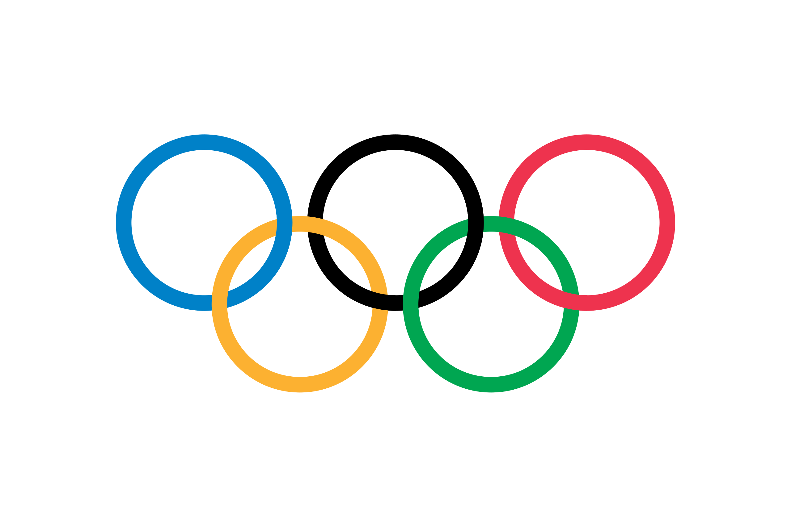

# A rendre ! 

### Réaliser une carte/un graphique sur les médailles aux jeux olympiques



Ce [jeu de données](https://github.com/KeithGalli/Olympics-Dataset?tab=readme-ov-file) contient un jeu de données complet sur les athlètes olympiques d'été et d'hiver et leurs résultats entre 1896 et 2022. Les données ont été *scrappées* depuis le site [olympedia.org](http://olympedia.org/)

```{ojs}
//| echo: false
data = d3.csv(
  "https://raw.githubusercontent.com/KeithGalli/Olympics-Dataset/refs/heads/master/clean-data/results.csv",
  d3.autoType
)

x = [...new Set(data.map((d) => d.discipline))]
```

- **Importez le jeu de données**

- **Choisissez un sport parmi les suivants**

```{ojs}
//| echo: false
md`${x.slice(0, -1).join(", ")} et ${x[x.length - 1]}.`
```

