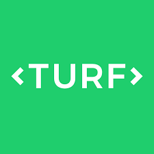
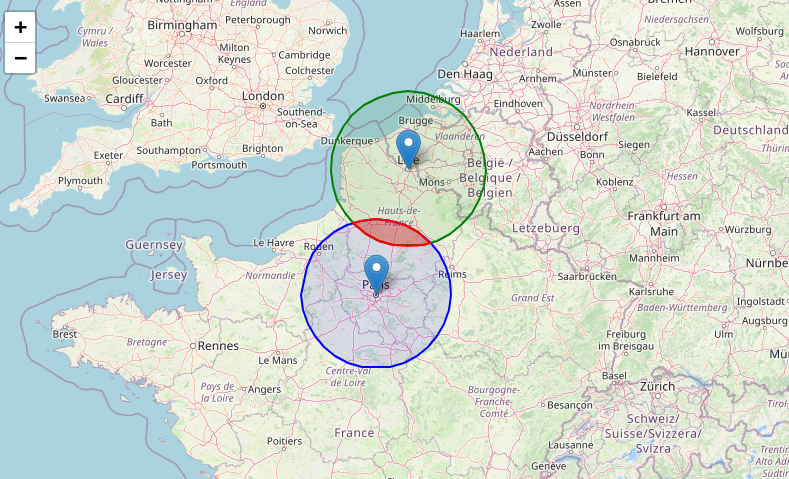

# Les SIG

#### Un géotraitement (ou geoprocessing en anglais) désigne l’ensemble des opérations qu’on peut appliquer à des données géographiques dans un SIG pour les transformer, les analyser ou les enrichir. Grace à des bibliothèques dédiées, il est possible d'effectuer un certain nombre d'opérations directement dans le navigateur Web.

# Turf.js




[Turf.js](https://turfjs.org/) est une bibliothèque JavaScript puissante et légère dédiée à l’analyse géospatiale (géotraitements). Elle permet de manipuler, transformer et analyser des données géographiques au format GeoJSON directement dans le navigateur ou dans un environnement Node.js. Avec Turf, on peut par exemple calculer des distances, des surfaces, des intersections, des buffers, des centroïdes, ou encore générer des grilles spatiales. Très utilisée dans les projets de cartographie interactive, notamment avec Leaflet ou Mapbox GL JS, Turf.js est précieuse pour effectuer des traitements spatiaux côté client sans avoir besoin d’un serveur SIG.

👉 **Documentation** : [https://turfjs.org](https://turfjs.org/)

Pour démarrer, commençons avec le code suivant : 

Copiez-le et executez-le dans jsfiddle.

```{.html .custom-html}
<script src="https://unpkg.com/leaflet/dist/leaflet.js"></script>
<link rel="stylesheet" href="https://unpkg.com/leaflet/dist/leaflet.css" />
<script src="https://cdn.jsdelivr.net/npm/@turf/turf@7/turf.min.js"></script>
<div id="titre">¡Hola, Cuba!</div>
<div id="map"></div>
```

```{.js .custom-js}
  // Coordonnées
  let coords = [
    [-75.1, 19.9], [-75.23, 19.9], [-77.74, 19.86], [-77.08, 20.47],
    [-78.07, 20.71], [-78.77, 21.64], [-79.9, 21.7], [-80.45, 22.07],
    [-81.82, 22.19], [-81.88, 22.68], [-82.78, 22.7], [-83.42, 22.19],
    [-84.52, 21.79], [-84.08, 22.67], [-82.22, 23.19], [-80.62, 23.09],
    [-78.68, 22.36], [-77.76, 21.81], [-76, 21.08], [-75.71, 20.69],
    [-74.77, 20.63], [-74.27, 20.07], [-75.1, 19.9]
  ];

  // Créer un GeoJSON avec Turf
  let cuba = turf.polygon([coords]);

  // Créer la carte Leaflet
  let map = L.map('map').setView([21.5, -79], 6);

  // Ajouter un fond OpenStreetMap
  L.tileLayer('https://{s}.tile.openstreetmap.org/{z}/{x}/{y}.png', {
    attribution: '&copy; OpenStreetMap contributors'
  }).addTo(map);

  // Ajouter le polygone GeoJSON
  L.geoJSON(cuba, { color: 'orange', weight: 2, fillOpacity: 0.5 }).addTo(map);
```


 ```{.css .custom-css}
#map { width: 100%; height: 480px; }
#titre {font-size: 25px;                   /* taille assez grande */
  font-weight: bold;                 /* texte gras */
  color: #267A8A;                    /* couleur agréable */
  text-align: center; 
  }
 ```

 👉 Surface

 ```{.js .custom-js}
let area = turf.area(cuba);
console.log(area)
```

 👉 Centroid

 ```{.js .custom-js}
let center = turf.centroid(cuba)
console.log(center)
```

 👉 Buffer

```{.js .custom-js}
let buffer = turf.buffer(center, 500)
```

 👉 Intersection

```{.js .custom-js}
let intersection = turf.intersect(turf.featureCollection([cuba, buffer]));
```

 👉 Tester si une ville est à l’intérieur de Cuba

```{.js .custom-js}
// On ajoute deux points (La Havane et Miami)
const havane = turf.point([-82.3666, 23.1136]);
const miami = turf.point([-80.1918, 25.7617]);

// Tester si les villes sont à l'interieur de Cuba
const testMiami = turf.booleanPointInPolygon(miami, cuba);
console.log(testMiami)
const testHavane = turf.booleanPointInPolygon(havane, cuba);
console.log(testHavane)
```

👉  Maintenant, calculons la distance entre deux points.


```{.js .custom-js}
const paris = [ 48.8534, 2.3488]
const vancouver = [49.2845, -123.1239]
const greatCircle = turf.greatCircle(paris.toReversed(), vancouver.toReversed(), {
  properties: { name: "de Paris à Vancouver" },
})
```

Créer une nouvelle carte leaflet, ajouter :

```{.js .custom-js}
L.marker(paris).addTo(map)
L.marker(vancouver).addTo(map)
L.geoJSON(greatCircle).addTo(map)
```

Calculer la longueur

```{.js .custom-js}
let length = turf.length(greatCircle, { units: "kilometers" });
console.log(length)
```

Voir à ce sujet : [le paradoxe de l'aviateur](https://www.humanite.fr/monde/regard-de-cartographe/le-paradoxe-de-laviateur)


::: {.callout-note title="Exercice"}

Un club de randonneurs veut savoir où se retrouver pour une marche. On leur donne deux points de départ (coordonnées GPS de deux villes). On veut :

- **Calculer la distance entre ces deux villes.**
- **Créer une zone tampon (buffer) de 30 km autour de chaque ville.**
- **Trouver l’intersection des deux zones tampons** (= la zone où les randonneurs peuvent se retrouver).

Code à compléter :

```{.html .custom-html}
  <script src="https://unpkg.com/@turf/turf@7/turf.min.js"></script>
  <h2>Exercice Turf.js : zone de rencontre</h2>
  <div id="output"></div>
```

```{.js .custom-js}
// Deux villes
const pointA = [2.3522, 48.8566] // Paris
const pointB = [3.0573, 50.6292] // Lille

// 1. Convertier en geoJSON

const cityA = turf.point(pointA);
const cityB = turf.point(pointB);

// 2. Calculer la distance (en km)
const distance = /* compléter ici */

// 3. Créer deux buffers de 30 km autour de chaque ville
const bufferA = /* compléter ici */
const bufferB = /* compléter ici */

// 4. Trouver l’intersection entre bufferA et bufferB
const intersection = /* compléter ici */


// 4. Afficher le resultat
document.getElementById("output").textContent =
"Distance entre Paris et Lille : " + distance.toFixed(2) + " km\n" +
      "Intersection trouvée ? " + (intersection ? "Oui ✅" : "Non ❌");

```

Fonctions à utiliser : 

`turf.distance(point1, point2, {units: 'kilometers'})`, `turf.buffer(point, radius, {units: 'kilometers'})`, `turf.intersect(bufferA, bufferB)`

Maintenant, on souhaite ajouter une visualisation avec leaflet.

Dans le html, on peut ajouter : 

```{.html .custom-html}
  <link rel="stylesheet" href="https://unpkg.com/leaflet/dist/leaflet.css" />
  <script src="https://unpkg.com/leaflet/dist/leaflet.js"></script>
```

et 

```{.html .custom-html}
<div id="map"></div>
```

N'oubliez pas le css

```{.css .custom-css}
#map {
    height: 500px;
}
```

Et dans la patrtie Javascript, ajoutez après les calculs turf.js : 

```{.js .custom-js}
 // 1. Initialiser la carte
    const map = L.map('map').setView([49.5, 2.7], 6);
    L.tileLayer('https://{s}.tile.openstreetmap.org/{z}/{x}/{y}.png', {
      attribution: '© OpenStreetMap contributors'
    }).addTo(map);


 // Ajout des markers
L.marker([pointA[1], pointA[0]]).bindPopup("Paris").addTo(map);
L.marker([pointB[1], pointB[0]]).bindPopup("Lille").addTo(map);   

// Ajout des buffers
L.geoJSON(bufferA, {color: "blue", weight: 2, fillOpacity: 0.1}).addTo(map);
L.geoJSON(bufferB, {color: "green", weight: 2, fillOpacity: 0.1}).addTo(map);
    if (intersection) {

// Ajout de la zone d'intersection avec une coloration conditionnnelle
L.geoJSON(intersection, {color: "red", weight: 2, fillOpacity: 0.3}).addTo(map);}
```
Le resultat devrait ressembler à quelque chose comme ça



:::


# Le format GeoJSON

GeoJSON est un format de données basé sur JSON, conçu pour représenter des objets géographiques simples et leurs propriétés associées. Il est largement utilisé dans les applications de cartographie web et les outils SIG modernes. Un fichier GeoJSON peut contenir des géométries (comme des points, des lignes, des polygones) et des propriétés (données attributaires). Par exemple, un point peut représenter une ville, avec des propriétés comme son nom ou sa population. GeoJSON est lisible par l'humain, facile à manipuler avec JavaScript, et compatible avec de nombreuses bibliothèques comme Leaflet, Maplibre GL ou Turf.js.


Voici à quoi ca ressemble : 

```{ojs}
//| echo: false
data = FileAttachment("data/paris.geojson").json()
data
```

Tapez `https://raw.githubusercontent.com/neocarto/Webmapping/refs/heads/main/data/paris.geojson` dans votre navigateur web.


Pour importer un jeu de données, on utilise la fonction `fetch()` ! 

Dans jsfiddle, executez le code suivant. 


```{.js .custom-js}
const data = fetch("https://raw.githubusercontent.com/neocarto/Webmapping/refs/heads/main/data/paris.geojson")
console.log(data)
```
Quel est le résultat affiché dans la console ? Que constatez-vous ?

<ins><b>Gestion des opérations asynchrones</b></ins><br/>

`fetch()` envoie une requête HTTP vers l’URL donnée. Cette requête prend un certain temps (millisecondes à secondes) pour obtenir une réponse. JavaScript **ne bloque pas** l’exécution en attendant la réponse. Il continue directement à la ligne suivante (console.log(data)). Donc fetch() ne renvoie pas le contenu directement, mais un objet **Promise**, qui représente une valeur qui sera disponible plus tard. 

`fetch()` est un fonction asynchrone. Une fonction asynchrone sert à gérer des opérations longues ou incertaines (comme appeler une API, lire un fichier, attendre une réponse du serveur, etc.) sans bloquer le reste du programme. Une fonction async permet de faire des choses en arrière-plan, tout en gardant un code clair et fluide, sans bloquer l’exécution.

Pour résoudre les promesses (promises) en JavaScript, il y a deux solution.

- `then()`

En JavaScript, `.then()` est une méthode qui sert à travailler avec les Promises. Quand une fonction asynchrone (comme fetch) retourne une Promise, cette Promise représente une valeur qui sera disponible plus tard. .then() permet de spécifier une action à exécuter une fois que la Promise est résolue (c’est-à-dire quand la valeur est disponible).

Dans jsfiddle, copiez le code suivant :

```{.js .custom-js}
fetch("https://raw.githubusercontent.com/neocarto/Webmapping/refs/heads/main/data/paris.geojson")
.then(response => response.json())
.then(data => {
console.log(data)
}) 
```

- `async` et `await`

`async` et `await` sont une autre façon de travailler avec les Promises, mais qui rend le code plus lisible, presque comme s’il était synchrone. On ne peut utiliser cette syntaxe que dans une fonction. On met le mot-clé `async` avant une fonction pour spécifier qu'il s'agit d'un fonction asynchrone. Puis, la fonction await permet de résoudre la promesse. Le code est bloque jusqu'à ce que la promesse est résolue.

```{.js .custom-js}
async function main() {
    const response = await fetch("https://raw.githubusercontent.com/neocarto/Webmapping/refs/heads/main/data/paris.geojson");
    const data = await response.json();
    console.log(data);
}

main();
```

Une solution très pratique est également d'utiliser la bibliothèque JavaScript **d3.js** (cous en reparlerons) plutot que fetch. L'avantage est quelle permet d'importer et interpreter d'autres formats de données, comme les fichiers csv par exemple. 

```{.js .custom-js}
import { json } from "https://cdn.jsdelivr.net/npm/d3-fetch@3/+esm";
json("https://raw.githubusercontent.com/neocarto/Webmapping/refs/heads/main/data/paris.geojson")
  .then(data => {
    // Suite de votre code ici
    console.log(data);
  });
```

ou


```{.js .custom-js}
import { json } from "https://cdn.jsdelivr.net/npm/d3-fetch@3/+esm";
async function main() {
const data = await json("https://raw.githubusercontent.com/neocarto/Webmapping/refs/heads/main/data/paris.geojson")
// Suite de votre code ici
console.log(data)
}
main()
```


# Manipuler un fichier geoJSON

Pour manipuler un geoJSON, on peut utiliser les fonctions JavaScript vues précédement.

Récupérer la première "feature"

```{.js .custom-js}
data.features[0]
```

Connaitre le nombre de pays

```{.js .custom-js}
data.features.length
```

Par exemple, récupérer tous les noms des arrondissements

```{.js .custom-js}
data.features.map(d => d.properties.l_aroff)
```
Ou récupérer toutes les géométries


```{.js .custom-js}
data.features.map(d => d.geometry)
```

Extraire le 6e arrondissement arrondissement


```{.js .custom-js}
data.features.filter(d => d.properties.c_ar == 6)
```

La plupart des fonctions de turf sont concues pour s'appliquer à une seule géométrie. Si on veut, par exemple, récupérer tous les centroides des arrondissements parisiens, il va falloir faire une boucle. 

```{.js .custom-js}
let centroids = data.features.map((feature) => {
  const center = turf.centroid(feature);
  center.properties = { ...feature.properties };
  return center;
})
console.log(centroids)
```


# Afficher un geoJSON

Pour afficher un geoJSON, on a besoin d'une bibliothèque JavaScript dédiée. Plusieurs options s'offrent à nous. Voici deux exemples :  

👉 **Avec Leaflet**

```{.html .custom-html}
<script src="https://unpkg.com/leaflet/dist/leaflet.js"></script>
<link rel="stylesheet" href="https://unpkg.com/leaflet/dist/leaflet.css" />
<div id="map"></div>
```

```{.js .custom-js}
import { json } from "https://cdn.jsdelivr.net/npm/d3-fetch@3/+esm";
async function main() {
const data = await json("https://raw.githubusercontent.com/neocarto/Webmapping/refs/heads/main/data/paris.geojson")
  const map = L.map('map');
//   const tiles = L.tileLayer('https://{s}.tile.openstreetmap.org/{z}/{x}/{y}.png', {
//   attribution: '© OpenStreetMap'
// }).addTo(map);
    const layer = L.geoJSON(data).addTo(map);
    map.fitBounds(layer.getBounds(), { maxZoom: 18});
}
main()

```

```{.css .custom-css}
#map {
    height: 350px;
}
```

# A vous de jouer

::: {.callout-note title="Exercice"}

- Charger le fond de carte des arrondissements parisiens
- Récupérez le 1er arrondissement (premiere feature. Indice zero)
- Calculer la surface ([https://turfjs.org/docs/api/area](https://turfjs.org/docs/api/area))
- Calculer le centre ([https://turfjs.org/docs/api/center](https://turfjs.org/docs/api/center))
- Créer une zone tampon de 500 mètres autour de ce point ([https://turfjs.org/docs/api/buffer](https://turfjs.org/docs/api/buffer))
- Faire la même chose pour le 2nd arrondissement.
- Calculer l'intersection ([https://turfjs.org/docs/api/intersect](https://turfjs.org/docs/api/intersect))
- Afficher la carte (avec leaflet)
- Changer la taille de la zone tampon si besoin
:::

# Geotoolbox

[Geotoolbox](https://riatelab.github.io/geotoolbox/) est une bibliothèque JavaScript développée pour faciliter la manipulation, l’analyse et la visualisation de données géographiques. Elle propose un ensemble d’outils modulaires destinés aux développeurs et aux cartographes, notamment pour le traitement de géométries en GeoJSON, la généralisation, le calcul d’indicateurs spatiaux, ou encore la mise en forme graphique de cartes. Pensée pour s’intégrer facilement dans des projets web, geotoolbox repose sur des standards ouverts et peut être utilisée en complément de bibliothèques comme D3.js ou MapLibre. 

👉 **Documentation** : [https://riatelab.github.io/geotoolbox/](https://riatelab.github.io/geotoolbox//)

POur importer la bibliothèque : 

```{.html .custom-html}
<script src="https://cdn.jsdelivr.net/npm/geotoolbox@3"></script>
```

ou 

```{.js .custom-js}
import { **a function** } from "https://cdn.jsdelivr.net/npm/geotoolbo@3/+esm"
```

Voici le fond de carte des arrondissements parisiens (affiché avec leaflet)


```{.js .custom-js}
import { json } from "https://cdn.jsdelivr.net/npm/d3-fetch@3/+esm";
async function DessineParis() {
const data = await json("https://raw.githubusercontent.com/neocarto/Webmapping/refs/heads/main/data/paris.geojson")
const map = L.map('map');
const layer = L.geoJSON(data).addTo(map);
map.fitBounds(layer.getBounds());
}
DessineParis()
```

- Union

```{.js .custom-js}
import { json } from "https://cdn.jsdelivr.net/npm/d3-fetch@3/+esm"
import { union } from "https://cdn.jsdelivr.net/npm/geotoolbox@3/+esm"
async function DessineParis() {
  const paris = await json("https://raw.githubusercontent.com/neocarto/Webmapping/refs/heads/main/data/paris.geojson")
  const merge = await union(paris)
  const map = L.map('map')
  const layer = L.geoJSON(merge).addTo(map)
  map.fitBounds(layer.getBounds())
}
DessineParis()
```

- Centroid

```{.js .custom-js}
import { centroid } from "https://cdn.jsdelivr.net/npm/geotoolbox@3/+esm"
const ctr = centroid(paris)
```

- Buffer

```{.js .custom-js}
import { buffer } from "https://cdn.jsdelivr.net/npm/geotoolbox@3/+esm"
const buff = await buffer(paris, {dist:50})
```

- Border

```{.js .custom-js}
import { border } from "https://cdn.jsdelivr.net/npm/geotoolbox@3/+esm"
const frontieres = await border(paris)
```

- Nodes


```{.js .custom-js}
import { nodes } from "https://cdn.jsdelivr.net/npm/geotoolbox@3/+esm"
const points = await nodes(paris)
```

- Convex Hull

```{.js .custom-js}
import { convexhull } from "https://cdn.jsdelivr.net/npm/geotoolbox@3/+esm"
const convex = await convexhull(ctr)
```

- Concave Hull

```{.js .custom-js}
import { concavehull } from "https://cdn.jsdelivr.net/npm/geotoolbox@3/+esm"
const concave = await concavehull(ctr)
```

- Simplify

```{.js .custom-js}
import { json } from "https://cdn.jsdelivr.net/npm/d3-fetch@3/+esm"
import { simplify } from "https://cdn.jsdelivr.net/npm/geotoolbox@3/+esm"
async function DessineParis() {
  const paris = await json("https://raw.githubusercontent.com/neocarto/Webmapping/refs/heads/main/data/paris.geojson")
  const simpl = simplify(paris, {k:0.001})
  const map = L.map('map')
  const layer = L.geoJSON(simpl).addTo(map)
  map.fitBounds(layer.getBounds())
}
DessineParis()
```

Et si on faisait une simplification interactive ?

```{.html .custom-html}
<script src="https://unpkg.com/leaflet/dist/leaflet.js"></script>
<link rel="stylesheet" href="https://unpkg.com/leaflet/dist/leaflet.css" />
<div>
  <label for="k">k : </label>
  <input type="range" id="k" min="0.0001" max="0.1" value="0.05" step="0.0001">
  <span id="valeur">0.2</span>
</div>
<div id="map"></div>
```

```{.css .custom-css}
#map {
    height: 500px;
}
```


```{.js .custom-js}
import { json } from "https://cdn.jsdelivr.net/npm/d3-fetch@3/+esm"
import { simplify } from "https://cdn.jsdelivr.net/npm/geotoolbox@3/+esm"

const map = L.map('map')
let layer; // pour stocker la couche

async function DessineParis(k) {
  const paris = await json("https://raw.githubusercontent.com/neocarto/Webmapping/refs/heads/main/data/paris.geojson")
  const simpl = simplify(paris, { k })
  
  // supprimer la couche précédente si elle existe
  if (layer) {
    map.removeLayer(layer)
  }
  
  layer = L.geoJSON(simpl).addTo(map)
  map.fitBounds(layer.getBounds())
}

// slider
const slider = document.querySelector("#k")
const valeur = document.querySelector("#valeur")

slider.addEventListener("input", () => {
  const k = parseFloat(slider.value)
  valeur.textContent = k.toFixed(3)
  DessineParis(k)
})

// initialisation
DessineParis(parseFloat(slider.value))
```

Problème de ce code : on télécharger le fond de carte à chaque fois qu'on bouge le slider.
Ce n'est pas très écolo.

Une solution possible :

```{.js .custom-js}
import { json } from "https://cdn.jsdelivr.net/npm/d3-fetch@3/+esm"
import { simplify } from "https://cdn.jsdelivr.net/npm/geotoolbox@3/+esm"

const map = L.map('map')
let layer
let original // stockera le GeoJSON original

async function init() {
  // charger une seule fois
  original = await json("https://raw.githubusercontent.com/neocarto/Webmapping/refs/heads/main/data/paris.geojson")
  DessineParis(parseFloat(slider.value))
}

function DessineParis(k) {
  const simpl = simplify(original, { k })
  
  if (layer) {
    map.removeLayer(layer)
  }
  
  layer = L.geoJSON(simpl).addTo(map)
  map.fitBounds(layer.getBounds())
}

const slider = document.querySelector("#k")
const valeur = document.querySelector("#valeur")

slider.addEventListener("input", () => {
  const k = parseFloat(slider.value)
  valeur.textContent = k.toFixed(3)
  DessineParis(k)
})

init()
```


