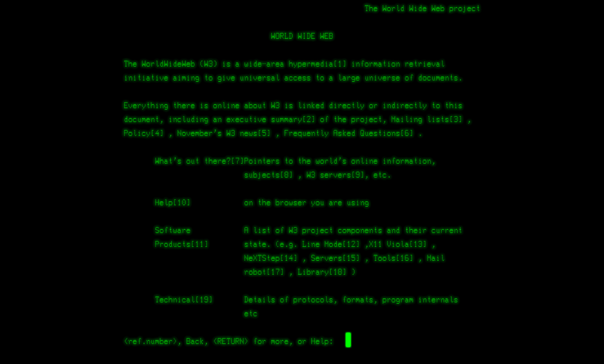
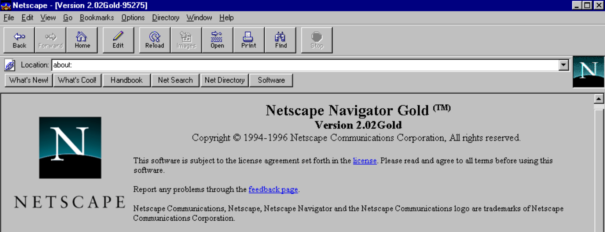
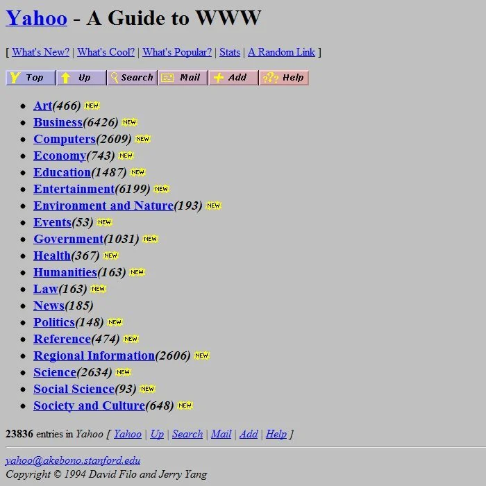
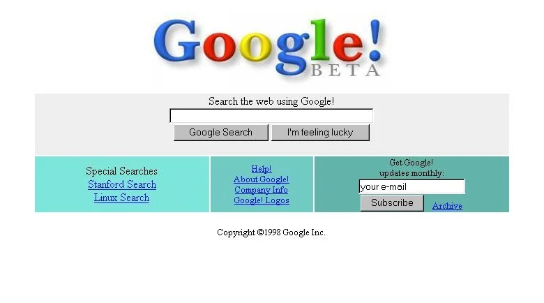
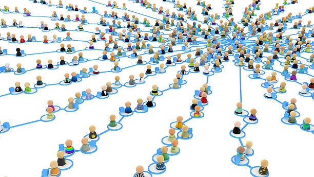
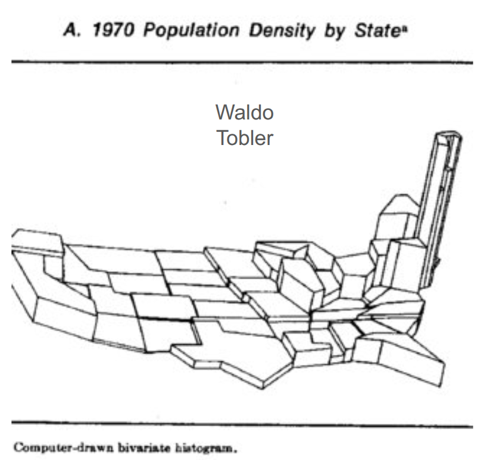
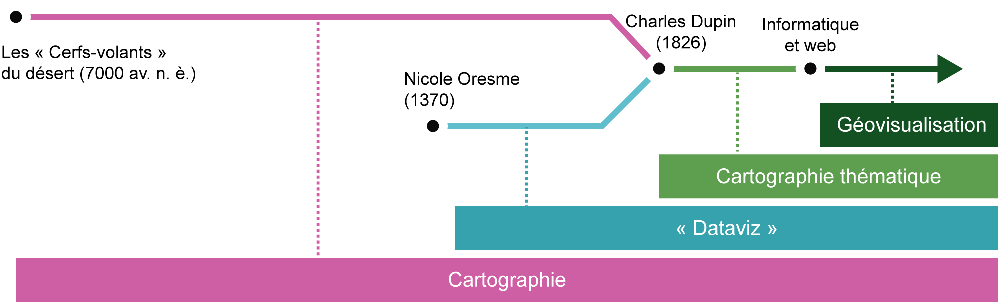
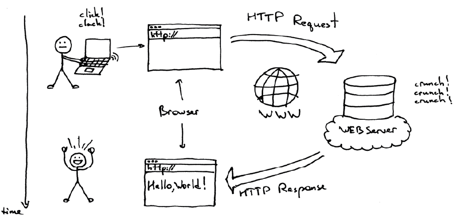
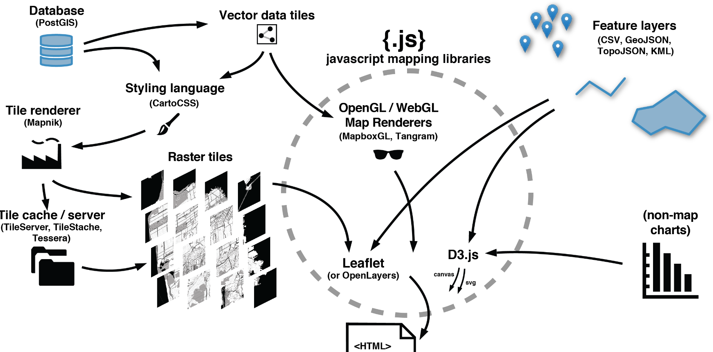

```{ojs}
//| echo: false
chart = { 
  const k = width / 80;
  const r = d3.randomUniform(k, k * 4);
  const n = 4;
  const data = Array.from({length: 100}, (_, i) => ({r: r(), group: i && (i % n + 1)}));
  const height = width / 3;
  const color = d3.scaleOrdinal(d3.schemeTableau10);
  const context = DOM.context2d(width, height);
  const nodes = data.map(Object.create);

  const simulation = d3.forceSimulation(nodes)
    .alphaTarget(0.3)
    .velocityDecay(0.1)
    .force("x", d3.forceX().strength(0.01))
    .force("y", d3.forceY().strength(0.01))
    .force("collide", d3.forceCollide().radius(d => d.r + 1).iterations(3))
    .force("charge", d3.forceManyBody().strength((d, i) => i ? 0 : -width * 2 / 3))
    .on("tick", ticked);

  d3.select(context.canvas)
    .on("touchmove", event => event.preventDefault())
    .on("pointermove", pointermoved);

  invalidation.then(() => simulation.stop());

  function pointermoved(event) {
    const [x, y] = d3.pointer(event);
    nodes[0].fx = x - width / 2;
    nodes[0].fy = y - height / 2;
  }

  function ticked() {
    context.clearRect(0, 0, width, height);
    context.save();
    context.translate(width / 2, height / 2);
    for (let i = 1; i < nodes.length; ++i) {
      const d = nodes[i];
      context.beginPath();
      context.moveTo(d.x + d.r, d.y);
      context.arc(d.x, d.y, d.r, 0, 2 * Math.PI);
      context.fillStyle = color(d.group);
      context.fill();
    }
    context.restore();
  }

  return context.canvas;
}
```

## Qu'est ce que le web ?

**1940 - ** Le premier ordinateur Le mathématicien Alan Turing pose les bases théoriques de ce que pourrait être un ordinateur.


**1969 - ** Internet est né d'une initiative militaire américaine. Le premier nœud du réseau ARPANET (Advanced Research Project Agency Network) à l'origine d'Internet a été mis en place en 1969.


**12 Mars 1989 - première version du Web** - Tim Berners-Lee, chercheur britannique au CERN, a inventé le WWW.


A l’origine, le projet, baptisé « World Wide Web », a été conçu et développé pour que des scientifiques travaillant dans des universités et instituts du monde entier puissent s'échanger des informations instantanément.



::: {.callout-tip collapse="false"}
## Web ou Internet ?

Internet est une plateforme qui permet de faire parvenir des informations d’un ordinateur à un autre. Le web, lui, est un moyen de visiter des pages de sites à partir de navigateurs via des ordinateurs, des tablettes ou des smartphones.
:::

**1991 - ** le Web s’ouvre à tous.

En **1993**, la technologie devient publique. Le Web voit très vite son usage exploser sur Internet.

**fin 1994**, le nombre de serveurs web atteint les 10 000 !

Le lancement de **Netscape**, le premier navigateur réellement grand public, participera aussi largement à sa démocratisation.



**Janvier 1994 - ** Yahoo !

Le nombre de sites explose, à tel point qu’il devient très difficile pour l’internaute béotien de s’y retrouver. Deux étudiants de Stanford, Jerry Yang et David Filo, décident de créer un gigantesque annuaire de sites, classés de façon thématique. Il va vite devenir le portail numéro 1 de la Toile.



**1998 - ** Google lance son moteur de recherche




**2010 - ** l’émergence du HTML5, le futur du Web


25 ans après son invention, le HTML fait une douce révolution, toujours sous l’impulsion de **Tim Berners-Lee**. Grâce à la cinquième version du standard de balisage des pages Web – et de nombreuses technologies associées – de nouveaux services émergent. Objectif de ce standard : transformer les pages Web, encore trop statiques, en véritables programmes informatiques, qui n’auraient rien à envier aux applications pour smartphones ou aux logiciels que vous installez sur votre ordinateur. Et faire du navigateur l’unique appli dont vous aurez besoin.

**Aujourd'hui**

Plus de 4 milliard d’utilisateurs 

</img>


## Qu'est ce que le webmapping ?


**Années 60**. Révolution quantitative en géographie et premier SIG Inspirée par les possibilités offertes par les mathématiques et l’informatique, la géographie tente de se redéfinir comme une science à part entière. L’année 1960 est aussi marquée par la mise en place, au Canada, du premier système d’information géographique (SIG).



Le webmapping (ou cartographie en ligne) désigne l’ensemble des techniques, outils et pratiques permettant de créer, publier et consulter des cartes interactives via Internet. 
En d’autres termes, c’est la rencontre entre la **cartographie** et le **Web**. le webmapping = la cartographie + l’interactivité + l’accessibilité via le Web.

## Webmapping ou géovisualisation ?

Ces deux notions sont souvent confondues. 

- Le webmapping désigne avant tout la mise en ligne de cartes interactives accessibles au plus grand nombre, avec des fonctions de navigation simples (zoom, déplacement, affichage de couches, recherche).

- La géovisualisation se concentre sur l’exploration et l’analyse visuelle de données géographiques, en proposant des outils plus avancés (filtres, symbolisation dynamique, animations temporelles) pour aider à comprendre des phénomènes spatiaux complexes. 



Autrement dit, le webmapping vise surtout la diffusion et l’accessibilité, alors que la géovisualisation met l’accent sur l’analyse et l’interprétation.

Dans ce cours, nous aborderons les deux aspects. Nous regarderons ce qui se passe **sous le capot**. Nous nous concentrerons sur les technologies **côté client**. 

## Architectures web (client/serveur)

Le Web fonctionne sur un modèle **client-serveur** : le navigateur (client) envoie une requête au serveur, qui renvoie une réponse contenant la page ou les données demandées. Le **navigateur** affiche ensuite ces informations à l’écran.



Une **web map** est composée de plusieurs éléments qui travaillent ensemble : le fond de carte (souvent en tuiles raster ou vectorielles), les données géographiques ajoutées par-dessus, et le style qui définit leur apparence. Le tout est affiché dans le navigateur grâce à une bibliothèque JavaScript (comme Leaflet ou MapLibre) qui permet l’interaction — zoom, clics, filtres. Le navigateur récupère les tuiles et les données auprès de serveurs, rendant la carte dynamique et modulaire.



*Source : [https://maptime.fun/anatomy-of-a-web-map](https://maptime.fun/anatomy-of-a-web-map)*

