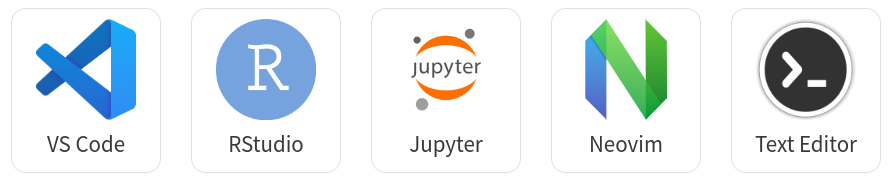
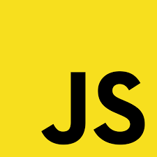
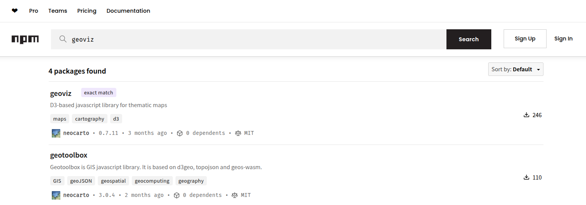
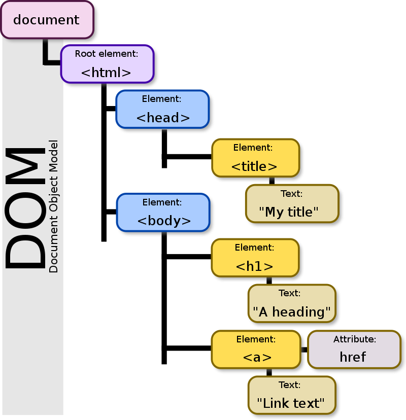

# Les langages du web

Les langages du web sont les technologies qui permettent de créer, structurer, styliser, et faire fonctionner des sites et applications web. On peut les classer en trois grandes catégories : langages de **structure**, de **style**, et de **comportement**, auxquels s’ajoutent les langages côté serveur et les technologies associées. 

👉 Un site web de référence : [https://developer.mozilla.org/fr/docs/Web](https://developer.mozilla.org/fr/docs/Web)

::: {.callout-tip title="Comment écrire et tester du code ?"}
Pour écrire du code, on utilise génralement une IDE (interface de développement). Il en existe de nombreux sur la marché et un certains nombre d'entre eux sont gratuits. Mais on peut utiliser un simple éditeur de texte type **notepad** ou **notepadd++**. Ensuite, il suffit d'ouvrir les fichiers avec votre navigateur web préféré. 
{width=70%}
Vous pouvez aussi utiliser des environnement de développement en ligne spécialement conçu pour tester, partager et déboguer du code.  On peut citer **JSFiddle**, **CodePen**, **JSBin**, **PlayCode**, **StackBlitz** ou **Observable**. Pour ce cours, je vous propose d'utiliser **JSFiddle**.

<a href="https://jsfiddle.net" target="_blank">
  {width="20%"}
</a>
:::

# Le HTML

Le **HyperText Markup Language**, généralement abrégé HTML est ce qui correspond au squelette d'une page web. C'est la structuration du document. Le HTML est structuré par des **balises** emboitées les unes dans les autres.


```{.html .custom-html}
<!DOCTYPE html>
<html>
  <head>
    <title>Page Title</title>
  </head>
  <body>
    <h1>This is a Heading</h1>
    <div id="mondiv">something here</div>
    <p>This is a paragraph.</p>
    <!-- commentaire -->
    <ul>
        <li>Pomme</li>
        <li>Banane</li>
        <li class= "highlight">Orange</li>
    </ul>

  </body>
</html>
```

En HTML, on peut créer des formulaires.

```{.html .custom-html}
<form>
  Nom : <input type="text"><br>
  Mot de passe : <input type="password"><br>
  Email : <input type="email"><br>
  Age : <input type="number" min="0"><br>
  Sexe : 
    <input type="radio" name="sexe" value="homme"> Homme
    <input type="radio" name="sexe" value="femme"> Femme<br>
  Abonnement : <input type="checkbox"><br>
  Date de naissance : <input type="date"><br>
  Couleur préférée : <input type="color"><br>
  Fichier : <input type="file"><br>
  <input type="submit" value="Envoyer">
</form>
```

Grâce à la balise `svg`, on peut même dessiner directement.
```{.html .custom-html}
<h1>Un cercle SVG</h1>
<svg width="200" height="200">
  <circle cx="100" cy="100" r="50" fill="green" />
</svg>
````


# Le CSS

Les feuilles de style en cascade, généralement appelées CSS de l'anglais Cascading Style Sheets, forment un langage informatique qui décrit la présentation des documents HTML. Le CSS définit le **style** et le **positionnement** des éléments sur la page.

```{.css .custom-css}
body {
  background-color: lightblue;
}

h1 {
  color: white;
  text-align: center;
}

p {
  font-family: verdana;
  font-size: 20px;
}

ul {
  list-style-type: disc;   /* Puces rondes par défaut */
  padding-left: 1em;       /* Légère indentation */
  font-family: sans-serif;
}

li {
  margin: 0.3em 0;         /* Petit espace entre les lignes */
}

```
On peut modifier le styles l'éléments spécifiques qu'on identifie par une **classe** ou un **identifiant**.

```{.css .custom-css}
#mondiv {
  background-color: #f0f8ff;   /* Bleu très clair */
  border-left: 4px solid #007acc; /* Liseré bleu */
  padding: 0.5em 1em;
  margin: 1em 0;
  font-family: sans-serif;
  font-size: 1rem;
}

.highlight {
  color: #c62828;               /* Rouge profond */
  font-weight: bold;
  background-color: #fff3e0;    /* Fond crème doux */
  padding: 0.2em 0.5em;
  border-radius: 4px;
}
```

En plus de définir les styles, le CSS permet de **positionner les éléments** dans la page web de différentes façons.

Le positionnement classique utilise la propriété position (**static**, **relative**, **absolute**, **fixed**, **sticky**) pour placer un élément de manière plus ou moins indépendante du flux normal. Pour des mises en page plus complexes, le système **CSS Grid** offre une grille en deux dimensions (lignes et colonnes) permettant d’organiser les éléments de façon souple et précise. Avec display: grid, on contrôle la structure, l’alignement, les espacements et la répartition des contenus, ce qui en fait une solution moderne et puissante pour le web design.


- **static** : position par défaut, l’élément suit le flux normal de la page.
- **relative** : l’élément reste dans le flux mais peut être décalé par rapport à sa position initiale.
- **absolute** : l’élément est retiré du flux et positionné par rapport à son ancêtre positionné le plus proche.
- **fixed** : l’élément est retiré du flux et reste fixé par rapport à la fenêtre du navigateur, même au défilement.
- **sticky** : l’élément se comporte comme relative mais devient fixé (fixed) lorsqu’on atteint une certaine position de scroll.
- **grid** : permet de disposer les élément dans une grille à lignes et colonnes pour un agencement précis et flexible.

```{.html .custom-html}
<div id="div1">mon div1</div>
<div id="div2">mon div2</div>
```

```{.css .custom-css}
#div1 {
  position: absolute;
  left: 10px;
  top: 10px;
}

#div2 {
  position: absolute;
  left: 120px;
  top: 10px;
}
```

Bien maitriser le CSS n'est pas évident. C'est un métier en soi.

Se référer à la documentation : [https://developer.mozilla.org/fr/docs/Web/CSS/position](https://developer.mozilla.org/fr/docs/Web/CSS/position)

# Le JavaScript

Le JavaScript est le langage de script du navigateur. Il fonctionne sur tous les navigateurs web sans avoir besoin d'installer quoi que ce soit. 

### 1995

Le langage Javascript a été créé en dix jours en mai 1995 pour la Netscape Communications Corporation par **Brendan Eich**. Au départ, l'idée était de construire un petit langage pour faire des interactions sur les pages web. Attention, Javascript n'est pas JAVA !

### 1997


Le langage Javascript est normalisé depuis 1997 par la commission TC39 de l'organisation ECMA International.

### 2008

Les navigateurs web ont travaillé à de nouveaux moteurs pour améliorer les performances. **V8** est un moteur JavaScript open-source développé par le projet Chromium pour les navigateurs Web Google Chrome et Chromium (dernière version 31 janvier 2022). Il y a aussi **SpiderMonkey** pour Firefox, **Chakra** pour Microsoft Edge et **JavaScriptCore** pour Safari.

### 2009

Création de Node.js par **Ryan Dahl**, qui permet d'utiliser le JavaScript comme langage de programmation côté serveur (back-End).

### 2015

Depuis 2015 (ES6 ou ES2015), le langage JavaScript est mature. Performant. Et est implémenté de manière harmonisée dans tous les navigateurs. On parle de *modern JavaScript*

### demain ?

De nouvelles fonctionnalitées sont ajoutées au langage chaque année.

### Une grande communauté

C'est un langage ancien qui dispose d'une très grande communauté.

### Les principes de base

Les variables permettent de stocker des donnes. 

```{.js .custom-js}
let age = 30;
const name = "Lakshmi";
```

Il existe plusieurs types de données : **number**, **string**, **boolean**, **objets**, **tableaux**, etc.


```{.js .custom-js}
let fruits = ["pomme", "banane"]; // Array
let person = { name: "Alice", age: 30 }; // Objet avec clés et valeurs
```

JavaScript est un langage fonctionnel. On ecrit beaucoup de fonctions. Par exemple : 

```{.js .custom-js}
function sayHello(name) {
  return "Hello " + name;
}
```

Ou, avec l'écriture flechée (arrow functions)

```{.js .custom-js}
const sayHello = (name) => {
  return "Hello " + name;
};
```

Pour visualiser les résultats, on peut utiliser la console.

```{.js .custom-js}
console.log(sayHello("dude"))
```

::: {.callout-tip title="Les outils de développement du navigateur"}
Les outils de développement du navigateur (souvent appelés **DevTools**) sont intégrés dans tous les navigateurs modernes (Chrome, Firefox, Edge, Safari). Ils servent à analyser, tester et déboguer des pages web en temps réel. On ne peut pas faire de développement web sans utiliser ces outils. Vous pouvez y accéder en général avec la touche **F12** ou Ctrl+Shift+I (Cmd+Opt+I sur Mac). L'onglet **console** permet de récupérer les instructions console.log(). 

*NB : jsfiddle dispose d'une console intégrée. Vous pouvez l'afficher en modifiant les paramètres de l'éditeur.* 
:::


Exécuter du code selon une condition.

```{.js .custom-js}
const age = 20;
if (age > 18) {
  console.log("Majeur");
} else {
  console.log("Mineur");
}
```


Répéter une action avec une boucle for

```{.js .custom-js}
for (let i = 0; i < 5; i++) {
  console.log(i);
}
```

### Le format JSON

Le JSON (JavaScript Object Notation) est un format léger de données créé en 2001 par **Douglas Crockford**. Il sert à représenter des informations sous forme de **paires clé-valeur** dans un texte lisible, facile à échanger entre applications. Très simple et universel, JSON est largement utilisé grâce à sa compatibilité avec de nombreux langages de programmation.

Voici à quoi ca ressemble. En fait, il s'agit d'un Array dont chaque élément est un objet. C'ets la façon qu'on a en JavaScrit de formaliser un tableau. 

```{.js .custom-js}
const books = [
{"titre":"Le Petit Prince","auteur":"Antoine de Saint-Exupéry","cycle":"jeunesse","annee":1943},
{"titre":"Harry Potter à l'école des sorciers","auteur":"J.K. Rowling","cycle":"jeunesse","annee":1997},
{"titre":"Les Misérables","auteur":"Victor Hugo","cycle":"classique","annee":1862},
{"titre":"Dune","auteur":"Frank Herbert","cycle":"science-fiction","annee":1965},
{"titre":"Indignez-vous !","auteur":"Stéphane Hessel","cycle":"essai","annee":2010},
{"titre":"Madame Bovary","auteur":"Gustave Flaubert","cycle":"classique","annee":1857},
{"titre":"1984","auteur":"George Orwell","cycle":"science-fiction","annee":1949},
{"titre":"Le Capital","auteur":"Karl Marx","cycle":"essai","annee":1867},
{"titre":"Fahrenheit 451","auteur":"Ray Bradbury","cycle":"science-fiction","annee":1953},
{"titre":"Surveiller et punir","auteur":"Michel Foucault","cycle":"essai","annee":1975},
]
```

Connaitre le nombre d'éléments

```{.js .custom-js}
console.log(books.length)
```

Récupérer la première ligne

```{.js .custom-js}
console.log(books[0]) // La numérotation des indices commence à 0 !
```

Récupérer le titre de la 2e ligne

```{.js .custom-js}
console.log(books[1].titre) 
```

Ajouter un élément en fin de tableau  (`push`)

```{.js .custom-js}
const newBooks = {"titre":"Harry Potter à l'école des sorciers","auteur":"J.K. Rowling","cycle":"jeunesse","annee":1997}
books.push(newBooks)
console.log(books)
```

Ajouter un élément au début du tableau (`unshift`)

```{.js .custom-js}
const newBooks2 = {"titre":"Le Deuxième Sexe","auteur":"Simone de Beauvoir","cycle":"essai","annee":1949}
books.unshift(newBooks2)
console.log(books)
```

Trier (`sort`)

```{.js .custom-js}
console.log(books.sort((a, b) => a.annee - b.annee))
```

Filtrer (`filter`)

```{.js .custom-js}
console.log(books.filter(d => d.cycle == "classique"))
```

Itérer avec `map` et `forEach`

```{.js .custom-js}
console.log(books.map(d => d.auteur))
```

```{.js .custom-js}
let auteurs = [];
books.forEach(d => {
  auteurs.push(d.auteur);
});
console.log(auteurs);
```

Récupérer des modalités uniques (`Set`)

```{.js .custom-js}
console.log(books.filter(d => d.cycle == "classique"))
```

Exemple de code classique.

```{.js .custom-js}
let cycles = books.map(d => d.cycle)
cycles = new Set(cycles)
cycles = Array.from(cycles)
console.log(cycles)
```

::: {.callout-note title="Exercice"}


Copiez ce code dans JSFidle et remplissez-le.

```{.js .custom-js}
// On va chercher un ficher JSON directement en ligne. Nous expliquerons fetch et then plus tard.
fetch("https://raw.githubusercontent.com/neocarto/Webmapping/refs/heads/main/data/cities.json")
  .then(response => response.json())
  .then(data => {
    // --------------------------
    // Commencez à travailler ici
    console.log(data)
    
    // Combien y a t-il de villes ?
    
    // Filtrez pour le conserver que les villes de plus de 500 000 habitants 

    // Combien y en a t'il ?

    // Combien y en a t-il dans l'hémisphère Sud ? 

    // Combien y en a t-il de villes de plus de 500 000 habitants en France ?

    // Affichez la liste

    // Fin
    // ------------------
});
```
:::

### Les bibliothèques

Une bibliothèque JavaScript est un ensemble de fonctions ou d’objets prêts à l’emploi, écrits en JavaScript, que tu peux réutiliser dans tes projets pour éviter de tout coder à la main. Les bibioltèques JavaScript sont disponibles dans [**npm**](https://www.npmjs.com/) (abréviation de Node Package Manager).

{width="100%"}

Il y a plusieurs façons d'importer une bibliothèque. Ici, on utilise un **CDN** (Content Delivery Network, ou réseau de diffusion de contenu). C’est la méthode la plus simple pour les projets HTML statiques.

**La bibliothèque confetti** 


```{.html .custom-html}
<!-- Import de la bibliothèque-->
<script src="https://cdn.jsdelivr.net/npm/canvas-confetti@1.6.0/dist/confetti.browser.min.js"></script>
```  

```{.js .custom-js}
confetti({
      particleCount: 150,
      spread: 70,
      origin: { y: 0.6 }
    });
```

**La bibliothèque leafet** 

[Leaflet](https://leafletjs.com/) est une bibliothèque JavaScript open source créée en 2010 par Vladimir Agafonkin, un développeur ukrainien. Elle permet de créer facilement des cartes interactives pour le web. C'ets une des plus connues et des plus ancvienne.

```{.html .custom-html}
<!-- Import de la bibliothèque et du css-->
<script src="https://unpkg.com/leaflet/dist/leaflet.js"></script>
<link rel="stylesheet" href="https://unpkg.com/leaflet/dist/leaflet.css" />
<div id="map"></div>
```  

```{.js .custom-js}
    const map = L.map('map').setView([51.505, -0.09], 13);

    L.tileLayer('https://{s}.tile.openstreetmap.org/{z}/{x}/{y}.png', {
      attribution: '© OpenStreetMap'
    }).addTo(map);
```

```{.css .custom-css}
#map {
    height: 500px;
}
```

Pour ajouter un marker et une popup :

```{.js .custom-js}
L.marker([51.5, -0.09]).addTo(map)
    .bindPopup('Une jolie popup.<br> facilement personnalisable.')
    .openPopup();
```

**La bibliothèque maplibre-gl** 

[MapLibre](https://maplibre.org/) est une bibliothèque JavaScript open source permettant d'afficher des cartes interactives vectorielles sur le web, en 2D ou en 3D (vue "globe"). Elle est née en 2020 suite à la décision de Mapbox de fermer le code source de Mapbox GL JS à partir de la version 2. MapLibre constitue donc une alternative libre, soutenue par une communauté active. 

```{.html .custom-html}
<!-- Import de la bibliothèque et du css-->
<script src="https://unpkg.com/maplibre-gl@latest/dist/maplibre-gl.js"></script>
<link href="https://unpkg.com/maplibre-gl@latest/dist/maplibre-gl.css" rel="stylesheet" />
<div id="map"></div>
```  

```{.js .custom-js}
const map = new maplibregl.Map({
  container: 'map',
  style: 'https://basemaps.cartocdn.com/gl/voyager-gl-style/style.json',
  center: [2.5, 46.8], // [lon, lat]
  zoom: 6,
});
```

```{.css .custom-css}
#map {
    height: 500px;
}
```

# Le DOM

Nous avons dit que le HTML était le squelette de la page, constitué des balises, des classes et d'identifiants. Une autre façon de voir ce squelette est de l'imaginer comme un arbre avec des noeuds et des ramifications. 



Le DOM (**Document Object Model**) est une représentation en mémoire de la page web, que JavaScript est capable de manipuler.

```
<html>
  <body>
    <p>Bonjour</p>
  </body>
</html>
```

devient

```
document
 └─ html
     └─ body
         └─ p
```

Pour acceder à un élement en JavaScript, on utilise `document.querySelector()`. Cela premet de récupérer le contenu d'un élément de la page web.

- `document.querySelector("#monid")` permet d'acceder à un noeud défini par un identifiant

- `document.querySelector(".maclasse")` permet d'acceder au premier élement d'une classe

- `document.querySelector("tag")` permet d'acceder au premier tag. Par exemple, `document.querySelector("p")` permet d'acceder au premier `<p>`.

Voici un squelete HTML : 


```{.html .custom-html}
<div id = "monid">Alea jacta est</div>
``` 

Et voici comment on peut interagir avec en JavaScript
 

```{.js .custom-js}
const montext = document.querySelector("#monid").textContent
console.log(montext)
```

Et ca permet aussi de le changer.


```{.js .custom-js}
document.querySelector("#monid").textContent = "coucou"
```

Et si je veux ajouter un point d'exclamation dans le div et le mettre en gras. 

```{.js .custom-js}
let mondiv = document.querySelector("#monid")
let baliseB = document.createElement("b");
baliseB.textContent = " !"
mondiv.appendChild(baliseB);
```

J'aurais aussi pu utiliser innerHTML : 


```{.js .custom-js}
monid.innerHTML = document.querySelector("#monid").textContent + "<b> !</>"
```

Du coup, vous pouvez rendre des calculs JavaScript dans le navigateur plutôt que dans la console.  

```{.html .custom-html}
<div>Dans ma mibliothèque, il y a <span id = "count"></span> livres.</div>
``` 

```{.js .custom-js}
const books = [
{"titre":"Le Petit Prince","auteur":"Antoine de Saint-Exupéry","cycle":"jeunesse","annee":1943},
{"titre":"Harry Potter à l'école des sorciers","auteur":"J.K. Rowling","cycle":"jeunesse","annee":1997},
{"titre":"Les Misérables","auteur":"Victor Hugo","cycle":"classique","annee":1862},
{"titre":"Dune","auteur":"Frank Herbert","cycle":"science-fiction","annee":1965},
{"titre":"Indignez-vous !","auteur":"Stéphane Hessel","cycle":"essai","annee":2010},
{"titre":"Madame Bovary","auteur":"Gustave Flaubert","cycle":"classique","annee":1857},
{"titre":"1984","auteur":"George Orwell","cycle":"science-fiction","annee":1949},
{"titre":"Le Capital","auteur":"Karl Marx","cycle":"essai","annee":1867},
{"titre":"Fahrenheit 451","auteur":"Ray Bradbury","cycle":"science-fiction","annee":1953},
{"titre":"Surveiller et punir","auteur":"Michel Foucault","cycle":"essai","annee":1975},
]

document.querySelector("#count").textContent = books.length
```

On peut aussi déclencher du code JavaScript en inetergissant sur la page.

```{.html .custom-html}
<script src="https://cdn.jsdelivr.net/npm/canvas-confetti@1.6.0/dist/confetti.browser.min.js"></script>
<button onclick="launchConfetti()">🎉 Clique ici !</button>
```

```{.js .custom-js}
    function launchConfetti() {
      confetti({
        particleCount: 100,
        spread: 70,
        origin: { y: 0.6 }
      });
    }
```

# Les écouteurs

Avec un écouteur `addEventListener` (recommandé), on aurait pu faire comme ca. Cette méthode a l'avantage de bien séparer le comportement (géré en JS) et la structure (squelette HTML).


```{.html .custom-html}
<script src="https://cdn.jsdelivr.net/npm/canvas-confetti@1.6.0/dist/confetti.browser.min.js"></script>
<button id="confettiBtn">🎉 Clique ici !</button>
```

```{.js .custom-js}
    function launchConfetti() {
      confetti({
        particleCount: 1000,
        spread: 500,
        origin: { y: 0.6 }
      });
    }
document.querySelector("#confettiBtn").addEventListener("click", launchConfetti)
```

Ici, on a utilisé `click`, mais il existe plein d'autres types dévenements, comme `dblclick`, `mouseover`, `mouseout`, `submit`, `change`, etc. Voir : [https://developer.mozilla.org/fr/docs/Web/Events](https://developer.mozilla.org/fr/docs/Web/Events).

Avec tout ce qu'on a appris, on peut désormais construire des applications web réactives. Reprenons notre SVG de tout à l'heure.

```{.html .custom-html}
<h1>Un cercle SVG réactif</h1>

<div>
  <label for="rayon">Rayon : </label>
  <input type="range" id="position" min="50" max="600" value="100">
  <span id="valeur">100</span>
</div>

<svg width="650" height="200">
  <circle id="monCercle" cx="100" cy="100" r="50" fill="green" />
</svg>
```


```{.js .custom-js}
const slider = document.querySelector("#position");
const valeur = document.querySelector("#valeur");
const cercle = document.querySelector("#monCercle");

slider.addEventListener("input", function () {
// Ici, nous avons choisi l'evenement input. Input e déclenche immédiatement à chaque modification de la valeur.
// Contrairement à change qui se déclenche uniquement quand l'utilisateur a terminé de bouger le curseur (et relâche la souris)
   const pos = slider.value;
   cercle.setAttribute("cx", pos);
   valeur.textContent = pos;
});
  ```

A vous de jouer !

::: {.callout-note title="Exercice"}

Reprennez l'exemple ci-dessus.

1 - dans un nouveau div, ajoutez un autre slider pour changer le rayon du cercle

2 - dans un nouveau div, ajoutez un élément de formulaire de type "color" pour changer la couleur du cercle.

:::